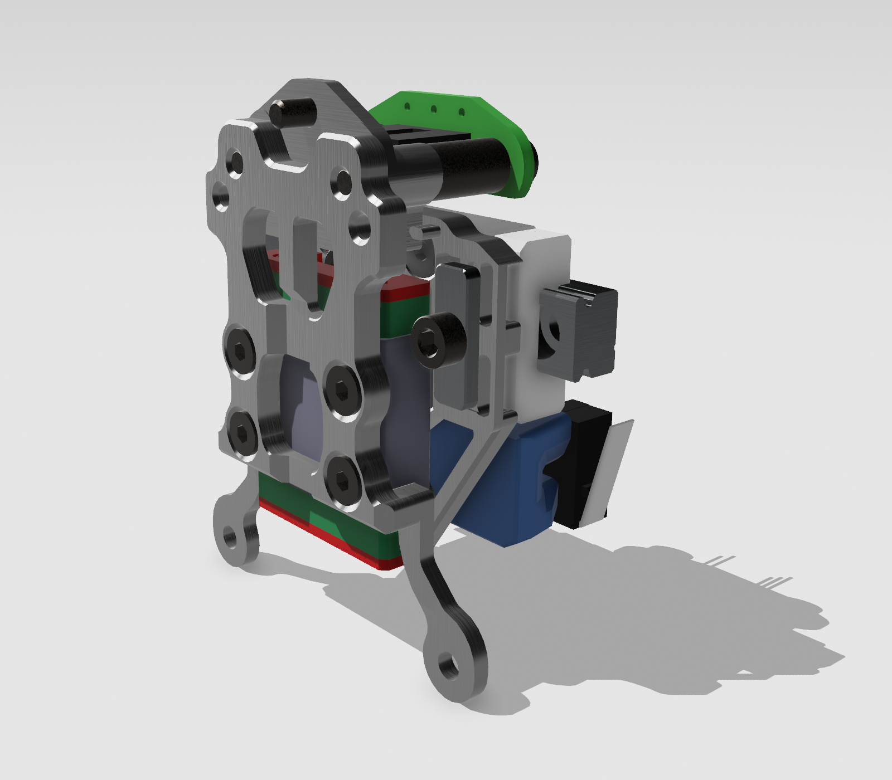

# MetalBoop

## 1. Introduction
  
  A smaller metal version of plastic [Boop](https://github.com/PrintersForAnts/Boop).

  MetalBoop shares many of the same features as Boop and [Tap](https://github.com/VoronDesign/Voron-Tap/), such as:
  * Microstep level accuracy
  * Durability due to optical switch
  * Simplicity - no dock and undock macros to fiddle with
  * Zero probe distance

## 2. Features
- Higher rigidity due to use of metals instead of plastic.
- Printed boop reduces Y travel by ~ 14mm, Metalboop by 8mm.
- Using a wide MGW7 rail instead of MGN9 - rigidity is on par with MGN12C while taking 1mm less space in Y direction.
- Placement of a singular high temprature magnet eliminates the need to assemble and configure lateral magnets on both sides.
- Special optional front plate has two extra bottom mounting holes for better attachment of DragonBurner v8 toolhead.
- Tested with DragonBurner v8 to ensure as much space as possible for hotend wiring.
- Modified version of Vitaliis CNC tap belt attachments.
- MetalBoop is shorter 10mm vertically - so no need to worry about build plate crashes.
## 3. Compatibility

Same as plastic [Boop](https://github.com/PrintersForAnts/Boop). Any Voron0 type toolhead compatible with front plate (eg. Mini StealthBurner). 100% compatible with Dragon Burner v8.

## 4. BOM

| Part | Quantity | Links |
|---|---|---|
| Rail STW7C 40mm Z2 preload 5mm edge-to-hole  | 1 | [Aliexpress](https://www.aliexpress.com/item/1005001499370117.html) |
| Magnet B842SH  | 1 | [Kj Magnetics](https://www.kjmagnetics.com/proddetail.asp?prod=B842SH) |
| M3 10mm spacer  | 2 | [Aliexpress](https://www.aliexpress.com/item/1005003018651855.html) |
| (optional) 2x Makerbeam T-slot - (drilled out to 3mm) | 2 | [Aliexpress](https://www.aliexpress.com/item/1005004891815148.html) |
| (optional) BHCS/SHCS M3x5 | 2 |  |
| BHCS/SHCS M3x22 | 2 |  |
| FHCS M3x5 | 8 |  |
| SHCS M3x4 | 1 |  |
| SHCS M3x5 | 1 |  |
| Slim version of OptoTAP PCB (5V only) | 1 | (EU) [Lab4450](https://lab4450.com/product/voron-tap-probe/) (select OptoTap v1.3 5v with Omron SX-EE398)   (NA) [Fabreeko](https://www.fabreeko.com/products/voron-tap-pcb?_pos=1&amp;amp;amp;amp;amp;amp;_psq=Tap&amp;amp;amp;amp;amp;amp;_ss=e&amp;amp;amp;amp;amp;amp;_v=1.0&amp;amp;amp;amp;amp;amp;variant=44462578368767) (select Voron TAP 5v)   |

## 5. Assembly
## 6. FAQ

1. When is it going to be available?
  * As soon as we finish internal testing. If everything goes by the plan we have and there are no major issues, **you can expect it to be available in around mid June 2024**.
        
2. What else besides the BOM do I need?
  * Unfortunately, from the start, we expect that for the first few weeks or months, you will also have to get parts manufactured on your own. There are online services such as JLCPCB or PCBWay which can make the parts. After some time, we hope vendors will pick up the design and make kits with already manufactured metal parts so you won’t have to do anything but buy a kit and assemble it.
        
3. I would like to sell manufactured metal parts. Can I do that free of charge or do I have to ask your permission or pay for license, royalties, etc?
  * MetalBoop is completely open source, released under MIT license. You can freely use designs for your commercial purposes free of charge.

## 7. Credits
- djeZo888 for sponsoring and initial testings
- Kizime123 for CAD design
- LillianaMirrors for the manual

Credits also go to:
- VoronTAP designers
- Boop designers
- AndyABG
- Solders
- Vitalii
