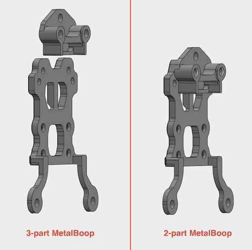

# MetalBoop

 

**Note: MetalBoop has been released as beta RC1 - first beta version. There are also five beta testers that are currently receiving, assembling and testing kits for free and will shortly get more information from them regarding beta RC1 - so far, the results are great and comparison charts vs plastic Boop will be posted soon. MetalBoop is an open source project - [CAD files are available for the public](./CAD). This site is under construction - new content is added daily.**

## 1. Introduction

  A smaller metal version of plastic [Boop](https://github.com/PrintersForAnts/Boop).

  MetalBoop shares many of the same features as Boop and [Tap](https://github.com/VoronDesign/Voron-Tap/), such as:
  * Microstep level accuracy
  * Durability due to optical switch
  * Simplicity - no dock and undock macros to fiddle with
  * Zero probe distance
  * Max chamber temperature: 100 C (when using OPB666N)

Input shaper improvement charts are available [here](./results).

## 2. Features
- Higher rigidity due to use of metals instead of plastic.
- Printed boop reduces Y travel by ~ 14mm, Metalboop by **only** 8mm.
- Using a wide MGW7 rail instead of MGN9 - rigidity is on par with MGN12C while taking 1mm less space in Y direction.
- Placement of a singular high temprature magnet eliminates the need to assemble and configure lateral magnets on both sides.
- Special optional front plate has two extra bottom mounting holes for better attachment of DragonBurner v8 toolhead.
- Tested with DragonBurner v8 to ensure as much space as possible for hotend wiring.
- Modified version of Vitaliis CNC tap belt attachments.
- MetalBoop is shorter 10mm vertically - so no need to worry about build plate crashes.
- Simplified assembly using printed mounting jigs for MGW7 rail and magnet.

  
## 3. Compatibility

Same as plastic [Boop](https://github.com/PrintersForAnts/Boop). Any Voron0 type toolhead compatible with front plate (eg. Mini StealthBurner). 100% compatible with [Dragon Burner v8 - DBv8](https://github.com/chirpy2605/voron/tree/main/V0/Dragon_Burner). All Hotends* and all Extruders are supported.

_* As reported by one beta tester, if using Dragon hotend then silicone sock needs to be cut a bit for everything to fit together properly._

## 4. BOM

| Part | Quantity | Links | Note
|---|---|---|---|
| CNC parts (2-part version) | 1 | [Open source CNC](./CAD/CNC) or [PCBWay](https://www.pcbway.com/project/shareproject/MetalBoop_2p_beta_RC1_de9ac2f4.html) | Order this if **you are NOT** using Dragon Burner V8 but any other Voron0 compatible toolhead such as mini StealthBurner. You need to order two parts - base plate and front plate! *
| CNC parts (2-part version for DBv8) | 1 | [Open source CNC](./CAD/CNC) or [PCBWay](https://www.pcbway.com/project/shareproject/Metal_Boop_DBv8_2p_beta_RC1_88e154ac.html) | Order this if **you are** using Dragon Burner V8. You need to order two parts - base plate and front plate! *
| Rail MGW7C/STW7C 40mm | 1 | [Aliexpress](https://www.aliexpress.com/item/1005001499370117.html) | Z2 (medium) preload, 5mm edge-to-hole
| Magnet B842SH  | 1 | (NA) [Kj Magnetics](https://www.kjmagnetics.com/proddetail.asp?prod=B842SH)  (EU) [Replimat](https://www.replimat.eu/metalboop-magnet-b842sh/rt10176) | To secure magnet, RTV Silicone is needed. Make sure you have it or get high quality one.
| M3 10mm spacer  | 2 | [Aliexpress](https://www.aliexpress.com/item/1005003018651855.html) | Only needed if using 3-part version of MetalBoop
| M3 10mm standoff  | 2 | [Aliexpress](https://www.aliexpress.com/item/1005005462128073.html) | Only needed if using 2-part version of MetalBoop (can also use plastic standoffs)
| 2x Makerbeam T-slot nut - (drilled out to 3mm) | 2 | [Aliexpress](https://www.aliexpress.com/item/1005004891815148.html) | Optional - only used to additionally secure belts
| BHCS/SHCS M3x5 | 2 |  | Optional - only used to additionally secure belts
| BHCS/SHCS M3x22 | 2 |  | Only needed if using 3-part version of MetalBoop
| BHCS M3x6 | 2 |  | Only needed if using 2-part version of MetalBoop
| FHCS M3x5 | 8 |  | Make sure these are 5mm; 6mm version is too long!
| SHCS M3x4 | 1 |  | Used to mount top part of MGW7 rail
| SHCS M3x5 | 1/3/5 |  | Used to mount bottom part of MGW7 rail; get extra 2pcs if not using sensorless homing; get extra 2pcs if using DragonBurner V8
| Slim version of OptoTAP PCB (5V only) | 1 | (EU) [Lab4450](https://lab4450.com/product/voron-tap-probe/) (select OptoTap v1.3 5v with Omron SX-EE398)   (NA) [Fabreeko](https://www.fabreeko.com/products/voron-tap-pcb?_pos=1&amp;amp;amp;amp;amp;amp;_psq=Tap&amp;amp;amp;amp;amp;amp;_ss=e&amp;amp;amp;amp;amp;amp;_v=1.0&amp;amp;amp;amp;amp;amp;variant=44462578368767) (select Voron TAP 5v) | Although either PCB type can be mounted, the larger version of the Tap PCB may interfere with either the extruder or extruder stepper.

_* Current latest available version is beta RC1 which is not rigorously tested by many users yet. Use at your own risk!_

## 5. Assembly

_Please, contact us if assembly manuals are unclear, so we can improve them. Thank you!_

_You can always check out [CAD design file](./CAD) to see how parts fit together._

   

#### A) Magnet

Start by assembling magnet into the hole as this task takes 24h for RTV to cure. [Recommended to use printed jig to help with correct assembly.](https://github.com/PrintersForAnts/MetalBoop/tree/main/STL/jigs#assembly-of-magnet)

#### B) Belts

Next attach base plate to X rail cart together with belts as shown in the picture provided by Vitalii (**Vitalii's belt mount**). Make sure that both belts are of equal lengths!

 

Note that MetalBoop has additional M3 holes for securing belt the same way as with plastic Boop. According to our tests, when base plate is made out of Alu7075 or better, it is enough to secure belts using only Vitalii's belt mount. If you are not sure, you may additionally secure belts using Makerbeam T-slot nuts, but make sure you drill them out with 3mm drill bit before as holes in T-slot nuts must be without threads!

Base plate is secured to X rail cart using **4x FHCS M3x5mm**. You have to do this step before mounting MGW7 rail, otherwise you won't be able to reach these screws.

#### C) MGW7 rail

Slide MGW7C cart off rail onto plastic jig that was supplied with the rail and save it. You do not have to clean/grease this rail.
[Detailed instructions regarding assembly of MGW7 is here.](https://github.com/PrintersForAnts/MetalBoop/tree/main/STL/jigs#assembly-of-mgw7-rail)

#### D) Sensor

How to mount optotap sensor PCB depends whether you have 2-part or 3-part MetalBoop. **Note if using OPB666N sensor, you may have to add 0.5mm shim in between standoffs/spacers and PCB, as OPB666N is a bit larger and would not fit otherwise.**

#### 2-part MetalBoop

 

#### 3-part MetalBoop

#### E) Finish

Slide MGW7C cart back onto MGW7 rail from below and make sure that the cart doesn't slide off before you complete next step. Carefully bring assembled front plate near assembled base plate. When front plate is very close to base plate, magnet's force will position front plate. Adjust position of MGW7C cart so that four mounting holes on cart align with front plate holes. Use **4x FHCS M3x5mm** screws to attach front plate to the cart. 

It is recommended to test MetalBoop before you continue with mounting toolhead. If boop'ing doesn't work correctly, then the issue is most likely in vertical position of sensor. You can adjust that by moving MGW7 rail slightly down and retightening its mounting screws ([make sure to use jigs - clamps](https://github.com/PrintersForAnts/MetalBoop/tree/main/STL/jigs#assembly-of-mgw7-rail)).

#### F) Misc

[If you are not using sensorless homing but rather endstop switches, please check out this page.](https://github.com/PrintersForAnts/MetalBoop/tree/main/STL#xy-homing-using-endstops)

## 6. FAQ

1. When is it going to be available?
  * MetalBoop has entered public beta RC1 phase. Note that this is public beta and there may be some small issues here and there. We are doing our best to list all found issues [here](#7-beta-issueschangelog).
        
2. What else besides the BOM do I need?
  * Unfortunately, from the start, we expect that for the first few weeks or months, you will also have to get parts manufactured on your own. CNC design files are available [here](./CAD/CNC). There are online services such as [JLCPCB](https://jlcpcb.com/) or [PCBWAY](https://www.pcbway.com/) which can make the parts. After some time, we hope vendors will pick up the design and make kits with already manufactured metal parts so you won’t have to do anything but buy a kit and assemble it.

3. What is the difference between 2-part and 3-part MetalBoop?
  * Boop usually consists of 3 main metal parts; those are:
    * base plate (screws into X rail cart and to which belts are attached),
    * front plate (screws into Boop's vertical MGW7 rail and toolhead) and
    * top plate (screws into front plate and where optical sensor PCB attaches to).
      
    
    
This configuration is called 3-part MetalBoop and is cheaper for CNC production. 2-part MetalBoop is optimisation to further increase rigidity by merging front and top plates together. But while more efficient and also easier to assemble, it can be 5-20 $ more expensive to produce. Both versions are available and the choice which one to get and assemble is yours.

   

4. How much downforce is there?
  * While for Voron Tap is being said that it needs 600g of force to uncouple, we measured MetalBoop needs around 1500g! This means that it is way more rigidly coupled than Tap, which should improve your input shaper charts and allows you to print with higher accelerations while maintaining same level of print quality. Note that more downforce is not always better - higher force can damage your printpad, so be aware of that when choosing MetalBoop. We recommend using textured PEI plate, invar plate or any other plate that has strong surface.

5. Is it mandatory to use T-nuts and M3 screws to attach belts?
  * While for plastic Boop, simply hooking belts between rail and plastic part turned out not to be enough, when using aluminum parts, this is not the case. Using additional T-nuts and screws is therefore completely optional thus redundant. 
        
6. I would like to sell manufactured metal parts. Can I do that free of charge or do I have to ask your permission or pay for license, royalties, etc?
  * MetalBoop is completely open source, released under GPLv3 license. You can freely use designs for your commercial purposes free of charge.

7. I am stuck with assembly/I do not understand assembly process. What should I do?
  * Get in contact with me or any other member of the team and ask for help. While also providing help to you, we will do our best to also update currently developed manuals on Github under [Assembly topic](#5-assembly). You can get in contact with us by opening issue in this GitHub repository or contact us in [Discord #CNC_boop channel](https://discord.com/channels/825469421346226226/1222971771444006996).

## 7. Beta issues/changelog
- Dragon hotend: small part of silicone sock needs to be cut for MetalBoop to fully fit

## 8. Credits
- [Kizime123](https://github.com/Kizime123) for CAD design
- [djeZo888](https://github.com/djeZo888) for sponsoring, GitHub page and initial testings

Credits also go to:
- [Voron TAP](https://github.com/VoronDesign/Voron-Tap/) designers
- [Boop](https://github.com/PrintersForAnts/Boop) designers
- [AndyABG](https://github.com/AndyABG)
- Solders
- [Vitalii](https://github.com/Vitalii3D-xyz)
