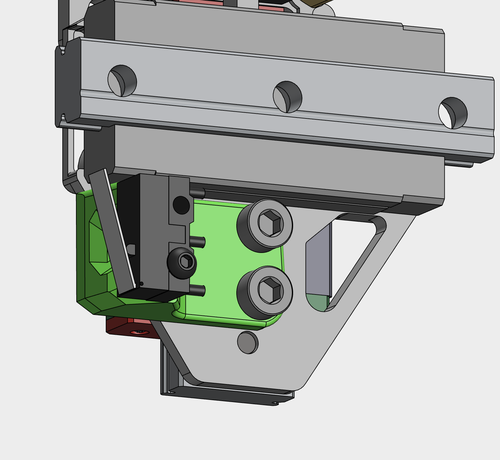

Parts in this folder should be printed prior starting with assembly of MetalBoop.

**endstop_holder_x1.stl** is plastic part that you have to print and attach to the back side of base plate when you are not using sensorless homing. Print it with material that can sustain chamber temps you'll use when printing, eg. same material as for other printer parts that are inside chamber (such as ABS, ASA,...). Use Voron recommended slicer settings.

Plastic part is attached to the base plate using two M3x5mm screws (**do not use longer than 5mm**, because there is not enough space!). Endstop switch is attached to the plastic part using one M2x10mm self-tapping screw.

Detailed instructions will be available soon with upcoming manuals.
