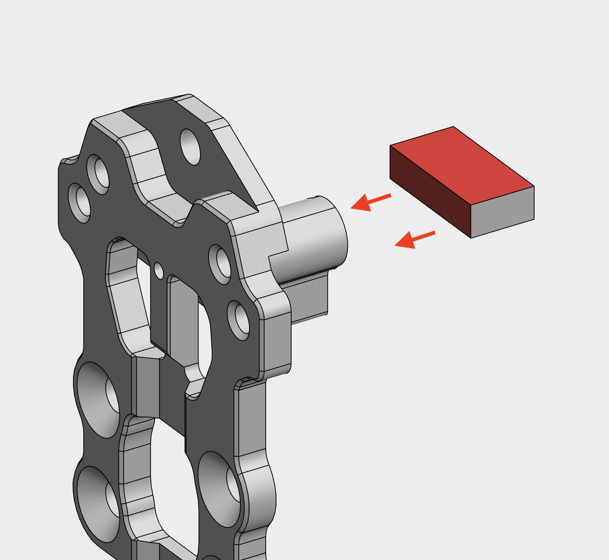
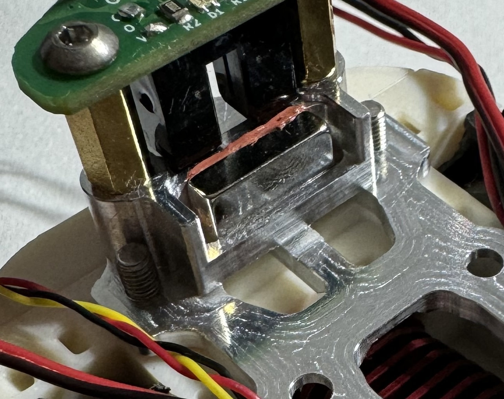

> [!TIP]
> Parts in this folder should be printed prior starting with assembly of MetalBoop.

### Assembly of magnet

> [!TIP]
> **It is recommended to perform this assembly task first because 24 hours is needed for RTV to cure.**

[**jig_magnet_x1.stl**](./jig_magnet_x1.stl) is used to help you with installation of magnet into oval hole. It makes sure that magnet sits in the middle of the hole and is in fully horizontal position. Print this jig using PLA or PETG with high details (recommended 0.4mm nozzle, Voron recommended slicer settings but with 0.1mm layer height).

Using flat surface tool such as credit card **evenly** coat two sides of magnet that touch insides of the hole with **thin** layer of RTV (check image above - two RTV coated sides are colored in red). Carefully insert magnet into the hole and try to position it in the middle. Then put the jig on the top and secure it with two M3 screws to nearby M3 holes (any short M3 screws are OK to be used). Leave this built assembly for 24 hours so RTV can cure.

> [!TIP]
> You can use hole in the middle of the jig and small hole in front aluminum part to poke magnet with non-magnetic stick to make sure it doesn't move around. If it does, then reprint jig scaled down for few 0.1% dimensions or properly tune your 3D printer.

After 24h unscrew M3 screws and remove the jig. Verify that the magnet is properly installed in the hole and cannot move (as in the picture below). If there is any RTV residue left on the bottom side of the magnet, you have to scrape that off, otherwise it will interfere with magnet's ability to touch top of the MGW7 rail with whole surface.

---

### Assembly of MGW7 rail

[**jig_rail_x2.stl**](./jig_rail_x2.stl) needs to be printed two times. These two parts are used to help secure MGW7 linear rail to the Base plate in fully vertical position - working as clamps. Print in PLA or PETG with at least Voron recommended slicer settings or better (more walls/infill). Clamps must be very rigid. If clamps are either too small to fit or too loose to fit firmly, scale them in slicer by few 0.1% up or down and reprint. Do that until you have clamps that fit firmly, but not too tight. You know that you have good clamps when rail doesn't move in any direction being clamped to the Base plate with only these two printed clamps (no screws).

Use two printed samples of this jig (clamps) when securing MGW7 rail to the Base plate. MGW7 linear rail must be in fully vertical position for MetalBoop to work properly. If it isn't when M3 screws that attach rail to the base plate are tightened, then loose these M3 screws and realign rail using printed clamps and tighten M3 screws again.

Use **SHCS M3x4mm** to secure upper part of the linear rail and **SHCS M3x5mm** to secure lower part of the linear rail. Shorter screw is used because there is X linear rail cart under base plate and 5mm long screw would not fit.

